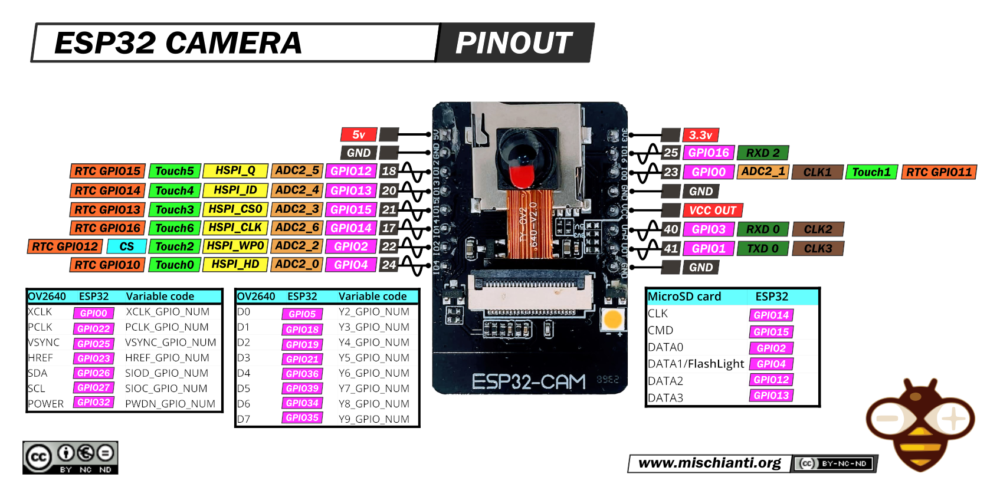
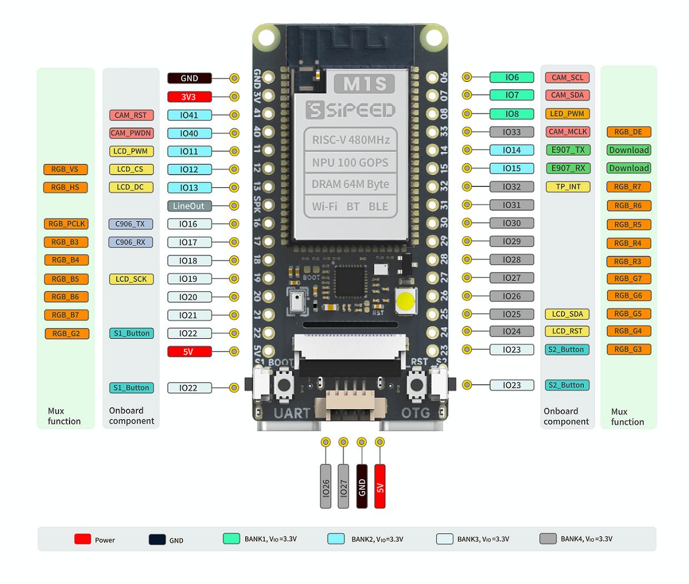

Small educational robot platform for $25 base price. Build around 3d print body

# Features
* skid steer mode of operation (**supported**)
* motor+steering wheel (**pending**)

* WiFi online control (**supported**)
* bluetooth joystick (**pending**)
* CRSF radio (**pending**)
* SBUS radio (**pending**)
* GPS positioning
* i2c peripherials

# BOM
## body
*  [body](model/rover.scad)
* 2x wheel set [passive + active](model/sv_tank/PLA_sv_wheels_2x.stl)
* 2x track (eiter [high profile](model/sv_tank/TPU_sv_track1.stl) or [low profile](model/sv_tank/TPU_sv_track2.stl))
* 2x M3 screw
* 2x M3 nuts
* 2x N20 motor
*  double H-bridge pwm controller
* 1S of 2S battery
* 

## control
Control hardware can be implemented in two flavours, more cheap and common esp32-cam, or more powerfull sipeed m1s dock
### ESP32-Camera

2 xtensa cores, 4mb of ram. i2c, i2s ports, wifi, bt, espnow connectivity 
as this board doesn't have direct USB support CP210x converter should be used.

Guide: [docs/ESP32-Flashing.md](docs/ESP32-Flashing.md)

Docs: http://www.ai-thinker.com/pro_view-24.html

### Sipeed M1S dock

Docs: https://wiki.sipeed.com/hardware/en/maix/m1s/m1s_dock.html

## equipment
### laser cannon
* https://arduino.ua/prod2551-servoprivid-tower-pro-mg995-180
* https://arduino.ua/prod1525-lazer-krasnii-krest-3v-650nm-5mvt-9mm

# links
* [https://github.com/devinzhang91/esp32_sv_tank](https://github.com/devinzhang91/esp32_sv_tank)
* [https://github.com/s60sc/ESP32-CAM_MJPEG2SD](https://github.com/s60sc/ESP32-CAM_MJPEG2SD)
* [https://github.com/whitecatboard/Lua-RTOS-ESP32](https://github.com/whitecatboard/Lua-RTOS-ESP32)
* [docs/resources.md](docs/resources.md)

