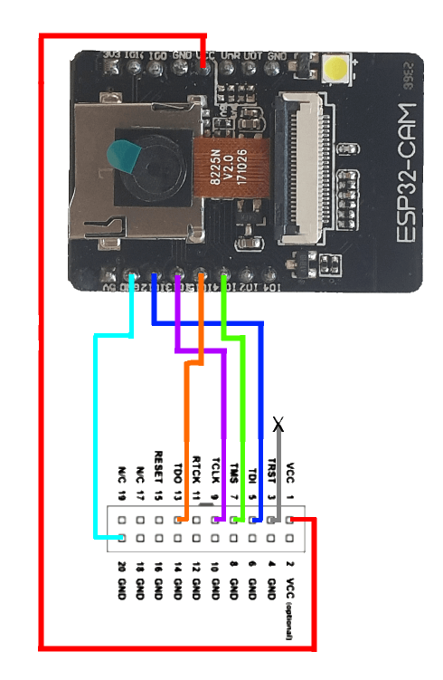

# ESP32 Flashing

Kit provides mechanism to flash esp32 in system, so ESP32-cam-mb is not advised to use.

Assuming ubuntu based system with Arduino IDE v2 installed

# Preparation 

## linux system 
This actions should be done once. 
```bash
sudo apt purge brltty modem-manager -y
sudo usermod -a -G dialout $USER
```

If you really need modem-manager you can try blacklisting 
the Arduino for modemmanager via udev rules:

```
echo 'ATTRS{idVendor}=="2341", ENV{ID_MM_DEVICE_IGNORE}="1"' | sudo tee -a /etc/udev/rules.d
sudo udevadm control --reload-rules
sudo udevadm trigger
```
You can find  out VENDOR_ID with 
`udevadm info --name=/dev/ttyACM0 |grep ID_VENDOR_ID`, 
if your board connects to /dev/ttyACM0

## arduino ide setup 
Please add the following into the “Additional Board Manager URLs” field:
```
https://raw.githubusercontent.com/espressif/arduino-esp32/gh-pages/package_esp32_index.json
```
Search for ESP32 in Board Manager and press install button for the “ESP32 by Espressif Systems“:
Go to `Tools > Board` and select `AI-Thinker ESP32-CAM`. You must have the ESP32 add-on installed. Otherwise, this board won’t show up on the Boards menu. If you have not done the installation, there is a guide below on how to do it.
Go to `Tools > Port` and select the COM port the board is connected to.

# Flashing


# debugging
To debug xtensa based chips you need additional piece of hardware: USB Blaster
[https://arduino.ua/prod4862-usb-programmator-blaster-v2-dlya-fpgacpld-altera-ot-waveshare](https://arduino.ua/prod4862-usb-programmator-blaster-v2-dlya-fpgacpld-altera-ot-waveshare)

then select Arduino debug hardware
# links
* [https://randomnerdtutorials.com/installing-the-esp32-board-in-arduino-ide-windows-instructions/](https://randomnerdtutorials.com/installing-the-esp32-board-in-arduino-ide-windows-instructions/)
* [https://www.geekering.com/categories/embedded-sytems/esp32/ricardocarreira/esp32-cam-board-how-to-begin-and-blink-a-led/](https://www.geekering.com/categories/embedded-sytems/esp32/ricardocarreira/esp32-cam-board-how-to-begin-and-blink-a-led/)
* [https://randomnerdtutorials.com/esp32-cam-troubleshooting-guide/](https://randomnerdtutorials.com/esp32-cam-troubleshooting-guide/)